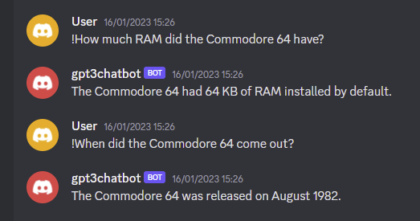
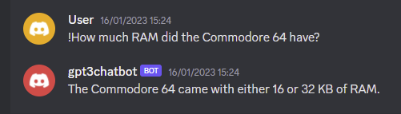

# GPT-3-Chatbot for Discord

---

Reacts to messages prefixed by "!".

Since it isn't possible to get sources for the gathered answers, the quality should always be questioned. Especially when the variables for the model are set to get more variations in answers, like temperature or topP.

API Key has to be provided in a file called ".env". Check out "env.example".
